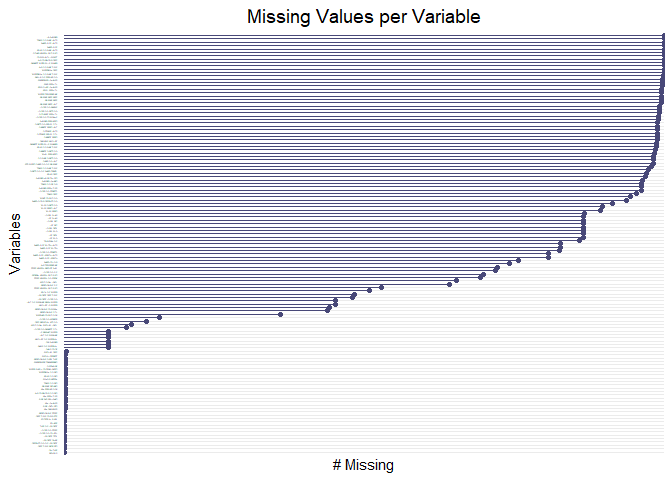

Oil Refinery Ownership Analysis
================
M Ilham AR Santoso
09/06/2024

``` r
#install.packages("readxl")
library(readxl)
#install.packages("dplyr")
library(dplyr)
```

    ## 
    ## Attaching package: 'dplyr'

    ## The following objects are masked from 'package:stats':
    ## 
    ##     filter, lag

    ## The following objects are masked from 'package:base':
    ## 
    ##     intersect, setdiff, setequal, union

``` r
#install.packages("readr")
library(readr)
#install.packages("stringr")
library(stringr)
#install.packages("tidyr")
library(tidyr)
#install.packages("ggplot2")
library(ggplot2)
#install.packages("naniar")
library(naniar)
```

``` r
data <- read.csv("~/Oil-Refinery/Analysis/Join Data/Full Merge/full_merge_compressed.csv.gz")
```

``` r
gg_miss_var(data) +
  theme_minimal() +
  theme(
    axis.text.x = element_text(angle = 90, hjust = 1, size = 10),  # Rotate x-axis labels
    axis.text.y = element_text(size = 1),  # Reduce y-axis label size to make it tiny
    plot.title = element_text(hjust = 0.5, size = 14)  # Center the title
  ) +
  labs(
    title = "Missing Values per Variable",
    y = "# Missing",
    x = "Variables"
  ) +
  scale_y_discrete(labels = function(labels) str_wrap(labels, width = 10)) 
```

<!-- -->
